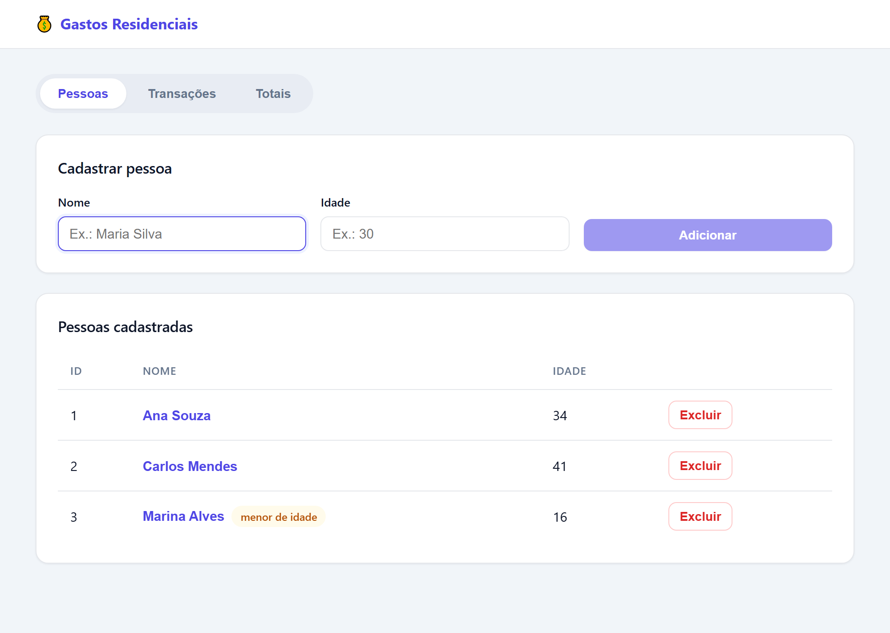
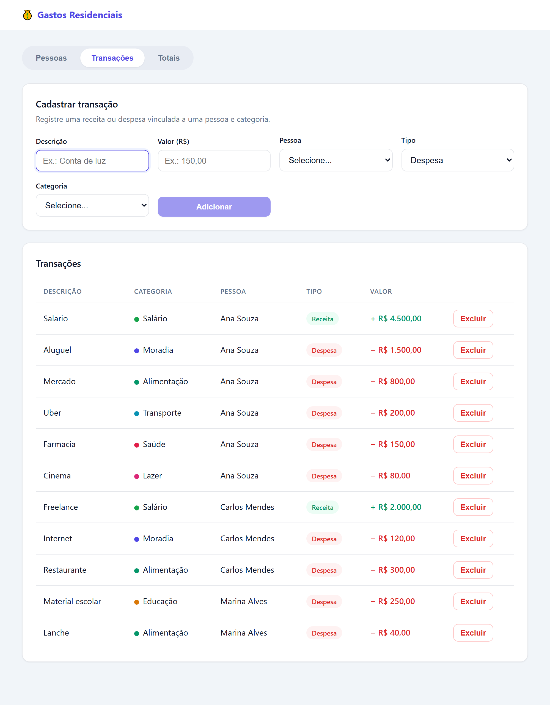
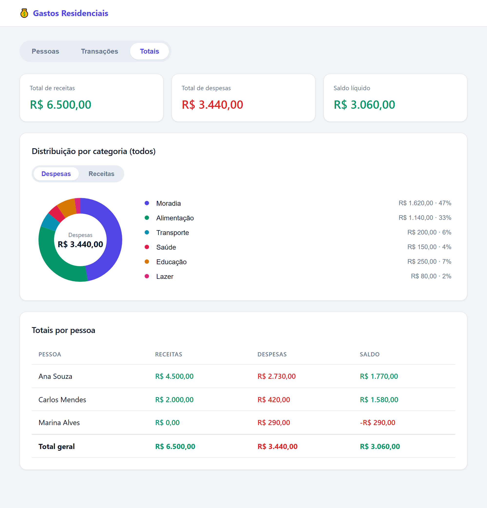
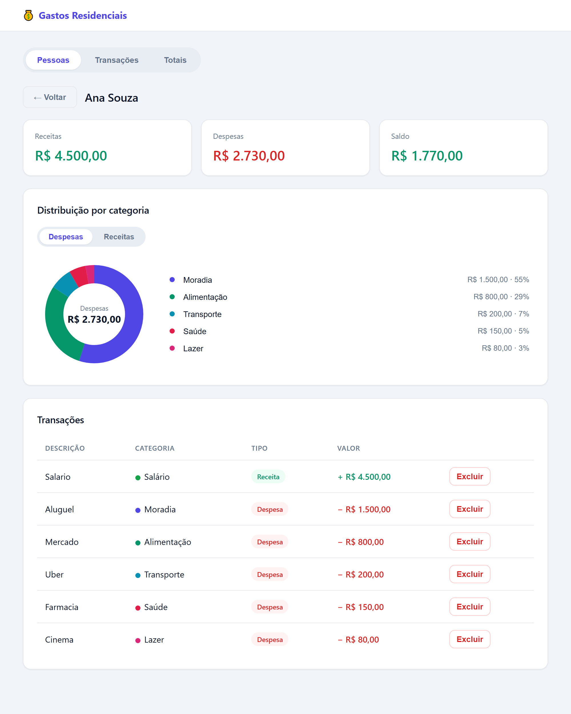

# 💰 Controle de Gastos Residenciais

Sistema de controle de gastos residenciais com **cadastro de pessoas**, **cadastro de transações** (receitas e despesas) e **consulta de totais** por pessoa e geral.

O projeto é dividido em duas partes:

- **Back-end:** API REST em **.NET 8 / C#** com **Entity Framework Core** e banco **SQLite**.
- **Front-end:** aplicação **React + TypeScript** criada com **Vite**.

---

## 📸 Demonstração

**Cadastro de pessoas** — clique no nome para abrir o dashboard individual.



**Cadastro de transações** — com categoria, tipo e exclusão.



**Consulta de totais (dashboard coletivo)** — resumo, gráfico por categoria e totais por pessoa.



**Dashboard individual** — receitas, despesas, gráfico e transações de cada pessoa.



---

## 🧰 Tecnologias

| Camada | Tecnologias |
|---|---|
| Back-end | .NET 8, C#, ASP.NET Core Web API, Entity Framework Core, SQLite, Swagger |
| Front-end | React 19, TypeScript, Vite |

---

## ✅ Funcionalidades

### Cadastro de pessoas
- Criar, listar e excluir pessoas.
- Identificador único gerado automaticamente.
- Ao **excluir uma pessoa**, todas as **transações dela também são excluídas** (cascata).

### Cadastro de transações
- Criar, listar e **excluir** transações (excluir uma transação **não** afeta a pessoa).
- Cada transação tem descrição, valor, tipo (**despesa** ou **receita**), **categoria** (Moradia, Alimentação, Transporte, Saúde, Educação, Lazer, Salário, Outros) e a pessoa dona.
- A pessoa informada precisa existir.
- **Regra:** pessoas **menores de 18 anos** só podem cadastrar **despesas** (nunca receitas) — validado no back-end e refletido na interface.

### Consulta de totais
- Lista todas as pessoas com **total de receitas, total de despesas e saldo** (receitas − despesas).
- Exibe o **total geral** somando todas as pessoas (receitas, despesas e saldo líquido).

### Dashboards e gráficos
- **Dashboard individual:** clique no nome de uma pessoa para ver os totais, o gráfico e as transações só dela.
- **Gráfico de rosca (donut) por categoria**, feito em **SVG puro** (sem biblioteca externa), no dashboard individual e no coletivo.
- Alternância entre **despesas/receitas** e **filtro por categoria** (clicar numa fatia destaca e filtra a lista).

### Persistência
- Os dados são gravados em um arquivo **SQLite** (`gastosresidenciais.db`), então **persistem após fechar a aplicação**.
- O banco é criado/atualizado **automaticamente** na primeira execução (via migrações do EF Core) — não é preciso rodar nenhum comando de banco manualmente.

---

## 📁 Estrutura do projeto

```
sistemagastosresidenciais/
├── backend/
│   ├── GastosResidenciais.sln
│   └── GastosResidenciais.Api/
│       ├── Controllers/     # Endpoints REST (Pessoas, Transacoes, Totais)
│       ├── Services/        # Regras de negócio (interfaces + implementações)
│       ├── Models/          # Entidades de domínio (Pessoa, Transacao)
│       ├── DTOs/            # Objetos de entrada/saída da API
│       ├── Data/            # AppDbContext (mapeamento EF Core)
│       ├── Middleware/      # Tratamento global de exceções
│       ├── Exceptions/      # Exceções de domínio
│       ├── Migrations/      # Migrações do banco
│       └── Program.cs       # Configuração da aplicação
├── frontend/
│   └── src/
│       ├── api/             # Cliente HTTP e tipos (espelham os DTOs)
│       ├── components/      # Componentes reutilizáveis (gráfico de rosca, etc.)
│       ├── pages/           # Telas: Pessoas, Transações, Totais, Dashboard
│       ├── utils/           # Utilitários (moeda, categorias)
│       ├── App.tsx          # Layout e navegação por abas
│       └── main.tsx         # Ponto de entrada
├── global.json              # Fixa o uso do SDK .NET 8
└── README.md
```

---

## ⚙️ Pré-requisitos

- **.NET SDK 8.0** — https://dotnet.microsoft.com/download/dotnet/8.0
- **Node.js 18+** (recomendado 20 ou superior) — https://nodejs.org

Para conferir se estão instalados:

```bash
dotnet --version
node --version
```

---

## ▶️ Como executar

> A aplicação tem duas partes. Suba **primeiro o back-end** e depois o front-end, em terminais separados.

### 1. Back-end (API)

Na raiz do projeto:

```bash
cd backend/GastosResidenciais.Api
dotnet run
```

A API sobe em **http://localhost:5049**.
A documentação interativa (Swagger) fica em **http://localhost:5049/swagger**.

> Na primeira execução o arquivo do banco (`gastosresidenciais.db`) é criado automaticamente.

### 2. Front-end (interface)

Em outro terminal, na raiz do projeto:

```bash
cd frontend
npm install
npm run dev
```

A interface abre em **http://localhost:5173**.

> Por padrão o front-end consome a API em `http://localhost:5049/api`. Para apontar para outro endereço, defina a variável de ambiente `VITE_API_URL`.

---

## 🔌 Endpoints da API

| Método | Rota | Descrição |
|---|---|---|
| `GET` | `/api/pessoas` | Lista todas as pessoas |
| `POST` | `/api/pessoas` | Cadastra uma pessoa (`nome`, `idade`) |
| `DELETE` | `/api/pessoas/{id}` | Exclui uma pessoa e suas transações |
| `GET` | `/api/transacoes` | Lista todas as transações |
| `POST` | `/api/transacoes` | Cadastra uma transação (`descricao`, `valor`, `tipo`, `pessoaId`) |
| `GET` | `/api/totais` | Retorna os totais por pessoa e o total geral |

### Exemplo — criar uma pessoa

```http
POST /api/pessoas
Content-Type: application/json

{
  "nome": "Maria Silva",
  "idade": 30
}
```

### Exemplo — criar uma transação

```http
POST /api/transacoes
Content-Type: application/json

{
  "descricao": "Salário",
  "valor": 5000,
  "tipo": "Receita",
  "pessoaId": 1
}
```

---

## 🧪 Testes automatizados

O back-end possui testes de unidade (**xUnit**) cobrindo as regras de negócio,
usando um banco **SQLite em memória** (rápido e isolado por teste).

Para rodar, na raiz do projeto:

```bash
cd backend
dotnet test
```

Principais cenários cobertos:

- Geração automática de Id e marcação de menor de idade (limite de 18 anos);
- Exclusão de pessoa apagando suas transações **em cascata**;
- **Menor de idade não pode cadastrar receita**;
- Transação com **pessoa inexistente** é rejeitada;
- Cálculo dos **totais por pessoa e do total geral** (incluindo pessoa sem transações).

## 🧠 Decisões técnicas

- **Arquitetura em camadas** (Controllers → Services → EF Core): os controllers ficam finos e as regras de negócio concentradas nos serviços.
- **DTOs** separam o contrato da API das entidades do banco (evitam over-posting e permitem validação de entrada).
- **Tratamento global de exceções**: erros de regra de negócio e de recurso não encontrado viram respostas HTTP padronizadas (400/404), mantendo os controllers limpos.
- **Enum salvo como texto** (`"Despesa"`/`"Receita"`) no banco, para legibilidade.
- **Totais calculados em memória** (C#) para garantir precisão com valores monetários (`decimal`), contornando limitações do SQLite em agregações de decimais.
- **Front-end** com cliente de API centralizado e tipagem espelhando os DTOs do back-end.
